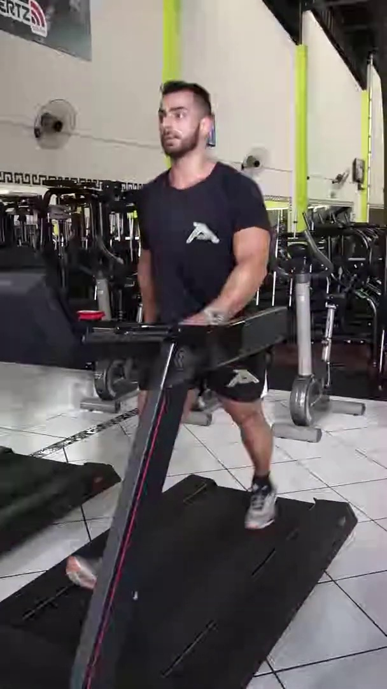
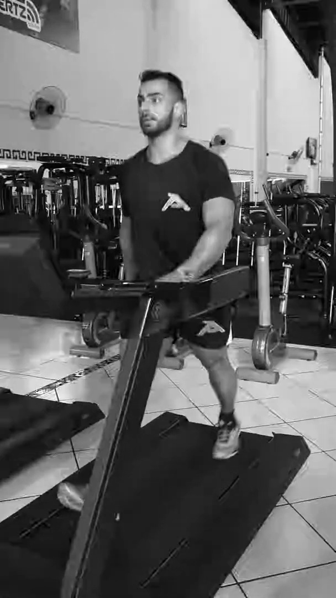

# Detecção de Objetos e Processamento de Imagem com OpenCV 🚀

Protótipo capaz de realizar pré-processamento de vídeo (Cinza, Filtro Canny) e detecção facial em tempo real utilizando classificadores Haar Cascade.

## 📋 O que o projeto faz

Este sistema processa fluxos de vídeo para identificar padrões e extrair características estruturais. Ele aplica filtros de imagem para otimização e utiliza algoritmos de detecção baseados em aprendizado de máquina (Haar Cascades) para localizar rostos em tempo real, servindo como base para sistemas de monitoramento inteligente.

## 🧠 O que eu aprendi

Durante o desenvolvimento deste projeto, explorei conceitos fundamentais de Visão Computacional:

* **Pipeline de Visão:** Construção do fluxo lógico desde a captura do frame bruto até a saída processada.
* **Tratamento de Frames Vazios:** Implementação de validações para evitar crashes ao final de vídeos ou falhas de stream.
* **Redimensionamento de Vídeo:** Ajuste de resolução para ganho de performance e redução de carga computacional.
* **Espaços de Cores:** Conversão para tons de cinza para simplificar a análise de dados.
* **Análise Estrutural:** Uso do Filtro de Canny para detecção de bordas e contornos.

## 🚀 Como rodar

1.  **Instale o OpenCV:**
    ```bash
    pip install opencv-python
    ```

2.  **Execute os scripts:**
    * Para ver o processamento de filtros e bordas:
        ```bash
        python src/main.py
        ```
    * Para ver a detecção facial em tempo real:
        ```bash
        python src/rosto.py
        ```

## 🖼️ 3. Mostre o Resultado (Visual é tudo!)

Abaixo estão os resultados gerados pelo algoritmo, provando a eficácia do processamento sem a necessidade de rodar o código:

### Detecção Facial (Retângulo Verde)
O sistema identifica a face e desenha um delimitador dinâmico.


### Filtro Canny (Detecção de Bordas)
Extração do "esqueleto" da imagem, essencial para monitoramento de movimento.


---
Desenvolvido por **Lucas Fernando Cobra**
